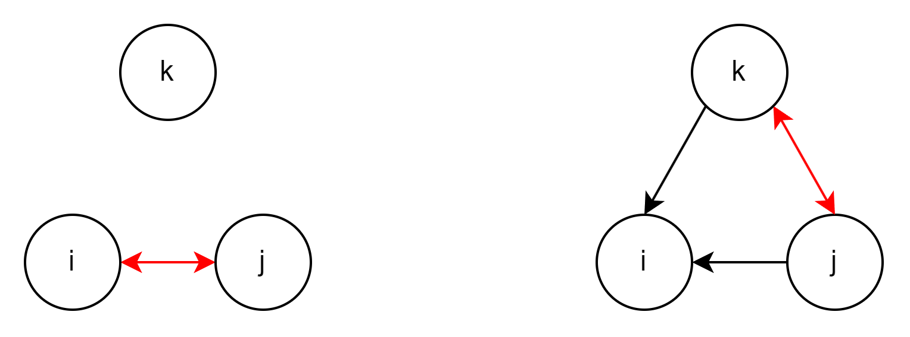
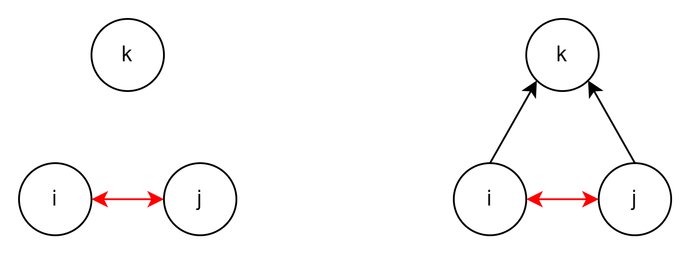

```{r setup, include=FALSE}
knitr::opts_chunk$set(echo = TRUE)
```

```{r}
rm(list=ls())
```

```{r}
library(RSiena)
library(foreach)
library(sna)
library(iterators)
library(doParallel)

```

# Set up parallel cluster

```{r}

no_cores <- detectCores() - 1
mycl <- makeCluster(rep("localhost", no_cores))
clusterEvalQ(mycl, library(RsienaTwoStep))
registerDoParallel(mycl)
# stopCluster(mycl)


```

# Prototype

These functions served as the idea of looping over a matrix. ftriads did not make a distinction between with or without repetition and included all configurations of a single unique triad. triad.evo does make a distiction and was used for the other versions of the function

```{r}
ftriads <- function(net) {
  
  if(ncol(net) < 3 & nrow(net) < 3){
    print(isTRUE(ncol(net) < 3 & nrow(net) < 3))
    print("warning: Matrix does not contain triads")
  } else{
    x <-
      foreach(a1=1:nrow(net), i=icount() , .combine="rbind") %:%
      foreach(a2=1:nrow(net), j=icount() , .combine="rbind") %:%
      foreach(a3=1:nrow(net),  k=icount() , .combine="rbind") %do% {
        if (i>=j & j>=k ) data.frame(i=i, j=j, k=k, sna::triad.census(net[c(a1,a2,a3),c(a1,a2,a3)])) #(i>j & j>k ) determines with or without repititions [current = NO REP]
      }
    triads <<-  x
    print(as.matrix(colSums(x[4:19])))
    # return(x)
  }
}

triad.evo <- function(net) {
  
  if(ncol(net) < 3 & nrow(net) < 3){
    print(isTRUE(ncol(net) < 3 & nrow(net) < 3))
    print("warning: Matrix does not contain triads")
  } else{
    x <-
      foreach(a1=1:nrow(net), i=icount() , .combine="rbind") %:%
      foreach(a2=1:nrow(net), j=icount() , .combine="rbind") %:%
      foreach(a3=1:nrow(net),  k=icount() , .combine="rbind") %do% {
        if (i>j & j>k ) data.frame(i=i, j=j, k=k, count=sna::triad.census(net[c(a1,a2,a3),c(a1,a2,a3)])) #(i>j & j>k ) determines with or without repititions [current = NO REP]
      }
    triad <<-  x
    print(as.matrix(colSums(x[4:19])))
    # return(x)
  }
}


# sna::triad.census(s501[1:3,1:3])

#langzaam, dus slechts op deel
# ftriads(s501[1:5,1:5]) #With repititions
# triad.evo(s501[1:5,1:5]) #Without repititions


```

# First version

This version of the function included a foreach for T1 and T2, determined the triad configuration of each triad at those timepoint and merged this into a dataset. However, this version did not allow us to see if the configuration of T2 build upon T1. For example: The transition from X102 (I & J have a reciprocal tie) to X120U (K & J have a reciprocal tie and send both send 1 tie to I) [figure 1] is different when the reciprocal tie between I & J would have stayed the same [figure 2] .

-   Figure 1

    

-   Figure 2

    

```{r}
triad.evolution <- function(t1,t2="def") { #Function no displays macro changes between t1 and t2, but no point of departure change
  
  xt1 <-
    foreach(a1=1:nrow(t1), i=icount() , .combine="rbind") %:%
    foreach(a2=1:nrow(t1), j=icount() , .combine="rbind") %:%
    foreach(a3=1:nrow(t1),  k=icount() , .combine="rbind") %do% {
      if (i>j & j>k ) data.frame(i=i, j=j, k=k, sna::triad.census(t1[c(a1,a2,a3),c(a1,a2,a3)])) #(i>j & j>k ) determines with or without repititions [current = NO REP]
    }
  print(xt1)
  xt1$stamp <- "t1"
  xt1$name <- paste0(xt1$i,xt1$j,xt1$k)
  xt1 <- subset(xt1, select=c(name,stamp,X003,X012,X102,X021D,X021U,X021C,X111D,X111U,X030T,X030C,X201,X120D,X120U,X120C,X210,X300))
  
  for(i in 1:nrow(xt1)){
    xt1$typeT1[i] <- colnames(xt1[which(xt1[i,] == 1)])#return the triad class for each triad
    
  }
  
  xt2 <-
    foreach(a1=1:nrow(t2), i=icount() , .combine="rbind") %:%
    foreach(a2=1:nrow(t2), j=icount() , .combine="rbind") %:%
    foreach(a3=1:nrow(t2),  k=icount() , .combine="rbind") %do% {
      if (i>j & j>k ) data.frame(i=i, j=j, k=k, sna::triad.census(t2[c(a1,a2,a3),c(a1,a2,a3)])) #(i>j & j>k ) determines with or without repititions [current = NO REP]
    }
  print(xt2)
  xt2$stamp <- "t2"
  xt2$name <- paste0(xt2$i,xt2$j,xt2$k)
  xt2 <- subset(xt2, select=c(name,stamp,X003,X012,X102,X021D,X021U,X021C,X111D,X111U,X030T,X030C,X201,X120D,X120U,X120C,X210,X300))
  
  for(i in 1:nrow(xt2)){
    xt2$typeT2[i] <- colnames(xt2[which(xt2[i,] == 1)])#return the triad class for a specific triad
    
  }
  
  test <<- merge.data.frame(subset(xt1, select=c(name,typeT1)),subset(xt2,select=c(name,typeT2)), by = "name")
  # triadst2 <<-  xt2
  # triadst1 <<-  xt1
  # print(as.matrix(colSums(xt2[4:19])))
  # print(as.matrix(colSums(xt1[4:19])))
  # print(as.matrix(colSums(xt2[3:18])-colSums(xt1[3:18])))
  # return(x)
}

```

```{r}
# t1 <- s501[1:4,1:4]
# t2 <- s502[1:4,1:4]
# timestamp()
# triad.evolution(s501[1:5,1:5],s502[1:5,1:5])
# timestamp()

```

```{r}
# if (i>j & j>k ) data.frame(i=i, j=j, k=k,
#                            ij=as.character(t1[a1,a2]), ji=as.character(t1[a2,a1]),
#                            ik=as.character(t1[a1,a3]),ki=as.character(t1[a3,a1]),
#                            jk=as.character(t1[a2,a3]),kj=as.character(t1[a3,a2]),
#                            count=sna::triad.census(t1[c(a1,a2,a3),c(a1,a2,a3) ])) #(i>j & j>k ) determines with or without repititions [current = NO REP]
# }

```

# Second version

This version was able to extract the configuration of each tie in the triad, but did not extract a final census. It was also not able to identify if a tie stayed the same and thus it is at a user's own discretion to determine the change of the triad between two observation points.

```{r}
triad.evolution2 <- function(t1,t2="def") { #Function no displays macro changes between t1 and t2, but no point of departure change
  
  xt1 <-
    foreach(a1=1:nrow(t1), i=icount() , .combine="rbind") %:%
    foreach(a2=1:nrow(t1), j=icount() , .combine="rbind") %:%
    foreach(a3=1:nrow(t1),  k=icount() , .combine="rbind") %do% {
      if (i>j & j>k ) data.frame(i=i, j=j, k=k,
                                 t1_ij=as.character(t1[a1,a2]), t1_ji=as.character(t1[a2,a1]),
                                 t1_ik=as.character(t1[a1,a3]),t1_ki=as.character(t1[a3,a1]),
                                 t1_jk=as.character(t1[a2,a3]),t1_kj=as.character(t1[a3,a2]),
                                 sna::triad.census(t1[c(a1,a2,a3),c(a1,a2,a3) ])) #(i>j & j>k ) determines with or without repititions [current = NO REP]
    }
  
  # print(xt1)
  
  xt1$stamp <- "t1"
  xt1$name <- paste0(xt1$i,".",xt1$j,".",xt1$k)
  t1 <- subset(xt1, select=c(name,stamp, t1_ij:t1_kj))
  xt1 <- subset(xt1, select=c(name,stamp,X003,X012,X102,X021D,X021U,X021C,X111D,X111U,X030T,X030C,X201,X120D,X120U,X120C,X210,X300))
  
  for(i in 1:nrow(xt1)){
    t1$typeT1[i] <- colnames(xt1[which(xt1[i,] == 1)])#return the triad class for each triad
    
  }
  
  # print(t1)
  
  xt2 <-
    foreach(a1=1:nrow(t2), i=icount() , .combine="rbind") %:%
    foreach(a2=1:nrow(t2), j=icount() , .combine="rbind") %:%
    foreach(a3=1:nrow(t2),  k=icount() , .combine="rbind") %do% {
      if (i>j & j>k ) data.frame(i=i, j=j, k=k,
                                 t2_ij=as.character(t2[a1,a2]), t2_ji=as.character(t2[a2,a1]),
                                 t2_ik=as.character(t2[a1,a3]),t2_ki=as.character(t2[a3,a1]),
                                 t2_jk=as.character(t2[a2,a3]),t2_kj=as.character(t2[a3,a2]),
                                 sna::triad.census(t2[c(a1,a2,a3),c(a1,a2,a3) ])) #(i>j & j>k ) determines with or without repititions [current = NO REP]
    }
  
  # print(xt2)
  
  xt2$stamp <- "t2"
  xt2$name <- paste0(xt2$i,".",xt2$j,".",xt2$k)
  t2 <- subset(xt2, select=c(name,stamp, t2_ij:t2_kj))
  xt2 <- subset(xt2, select=c(name,stamp,X003,X012,X102,X021D,X021U,X021C,X111D,X111U,X030T,X030C,X201,X120D,X120U,X120C,X210,X300))
  
  
  for(i in 1:nrow(xt2)){
    t2$typeT2[i] <- colnames(xt2[which(xt2[i,] == 1)])#return the triad class for a specific triad
    
  }
  # print(t2)
  Triad_change <<- merge.data.frame((t1),subset(t2,select=c(name, stamp, t2_ij:t2_kj, typeT2)), by = "name")
  
  
}
```

# Third version

This "final" version of the function is able to distinguish and filter between ties that "flip" between two points of observation, which was determined by checking if the sum of changes between the 6 possible ties is more than 2. If these changes occur more often than 2, this is not something that RSienaTwoStep could estimate. For example: a change from X003 to X300 or from X300 to X102. The function outputs these large change triads, so they can be analysed by the user. The choice can be made to analyse the census with these large changing triads or without by using the 'filter = TRUE' condition. The final output is a reshaped table that orders the amount of triads that changed from most to least occuring. A dataset with the triads name (the numbered alters, 1.2.3), type at T1 and T2 and the configuration are exported to the environment

```{r}
triad.evolution3 <- function(t1,t2, filter = FALSE) { #Function no displays macro changes between t1 and t2, but no point of departure change
  
  xt1 <-
    foreach(a1=1:nrow(t1), i=icount() , .combine="rbind") %:%
    foreach(a2=1:nrow(t1), j=icount() , .combine="rbind") %:%
    foreach(a3=1:nrow(t1),  k=icount() , .combine="rbind") %do% {
      if (i>j & j>k ) data.frame(i=i, j=j, k=k,
                                 t1_ij=as.character(t1[a1,a2]), t1_ji=as.character(t1[a2,a1]),
                                 t1_ik=as.character(t1[a1,a3]),t1_ki=as.character(t1[a3,a1]),
                                 t1_jk=as.character(t1[a2,a3]),t1_kj=as.character(t1[a3,a2]),
                                 sna::triad.census(t1[c(a1,a2,a3),c(a1,a2,a3) ])) #(i>j & j>k ) determines with or without repititions [current = NO REP]
    }
  
  # print(xt1)
  
  xt1$stamp <- "t1"
  xt1$name <- paste0(xt1$i,".",xt1$j,".",xt1$k)
  t1 <- subset(xt1, select=c(name,stamp, t1_ij:t1_kj))
  xt1 <- subset(xt1, select=c(name,stamp,X003,X012,X102,X021D,X021U,X021C,X111D,X111U,X030T,X030C,X201,X120D,X120U,X120C,X210,X300))
  
  for(i in 1:nrow(xt1)){
    t1$typeT1[i] <- colnames(xt1[which(xt1[i,] == 1)])#return the triad class for each triad
    
  }
  
  # print(t1)
  
  xt2 <-
    foreach(a1=1:nrow(t2), i=icount() , .combine="rbind") %:%
    foreach(a2=1:nrow(t2), j=icount() , .combine="rbind") %:%
    foreach(a3=1:nrow(t2),  k=icount() , .combine="rbind") %do% {
      if (i>j & j>k ) data.frame(i=i, j=j, k=k,
                                 t2_ij=as.character(t2[a1,a2]), t2_ji=as.character(t2[a2,a1]),
                                 t2_ik=as.character(t2[a1,a3]),t2_ki=as.character(t2[a3,a1]),
                                 t2_jk=as.character(t2[a2,a3]),t2_kj=as.character(t2[a3,a2]),
                                 sna::triad.census(t2[c(a1,a2,a3),c(a1,a2,a3) ])) #(i>j & j>k ) determines with or without repititions [current = NO REP]
      
    }
  
  # print(xt2)
  
  xt2$stamp <- "t2"
  xt2$name <- paste0(xt2$i,".",xt2$j,".",xt2$k)
  t2 <- subset(xt2, select=c(name,stamp, t2_ij:t2_kj))
  xt2 <- subset(xt2, select=c(name,stamp,X003,X012,X102,X021D,X021U,X021C,X111D,X111U,X030T,X030C,X201,X120D,X120U,X120C,X210,X300))
  
  
  for(i in 1:nrow(xt2)){
    t2$typeT2[i] <- colnames(xt2[which(xt2[i,] == 1)])#return the triad class for a specific triad
    
  }
  # print(t2)
  df <- merge.data.frame((t1),subset(t2,select=c(name, stamp, t2_ij:t2_kj, typeT2)), by = "name")
  
  for(i in 1:nrow(df)){
    # print(i)
    
    df$equal[i] <- sum(df[i, 3:8] != df[i, 11:16]) <= 2
    # print(Triad_change$equal[i])  
    
  }
  
  print(as.data.frame(df[which(df$equal == FALSE),c("name", "typeT1", "typeT2", "equal")]))
  
  Triads <<- df
  
  if(filter == TRUE){
    
    filt <- df[df$equal == TRUE,]
    tab_filt <- reshape2::melt(table(filt$typeT1, filt$typeT2, dnn = c("Timepoint 1", "Timepoint 2")))
    print(tab_filt[order(tab_filt$value, decreasing = TRUE),])
    # test_filt <<- filt
    
    
  } else{
    test_tab <- reshape2::melt(table(df$typeT1, df$typeT2, dnn = c("Timepoint 1", "Timepoint 2")))
    print(test_tab[order(test_tab$value, decreasing = TRUE),])
    # test_nofilt <<- df
  }
  # test_f <<- filt
}

```

## Example with filter

```{r}

triad.evolution3(s501[1:10,1:10],s502[1:10,1:10], filter = TRUE)


```

## Example without filter

```{r}
triad.evolution3(s501[1:10,1:10],s502[1:10,1:10], filter = FALSE)

```

# Possible alterations

-   Fluid naming of the dataset, so it is not overwritten when the code is used in succession

-   The function is quite intensive for large networks

-   

```{r}

```
